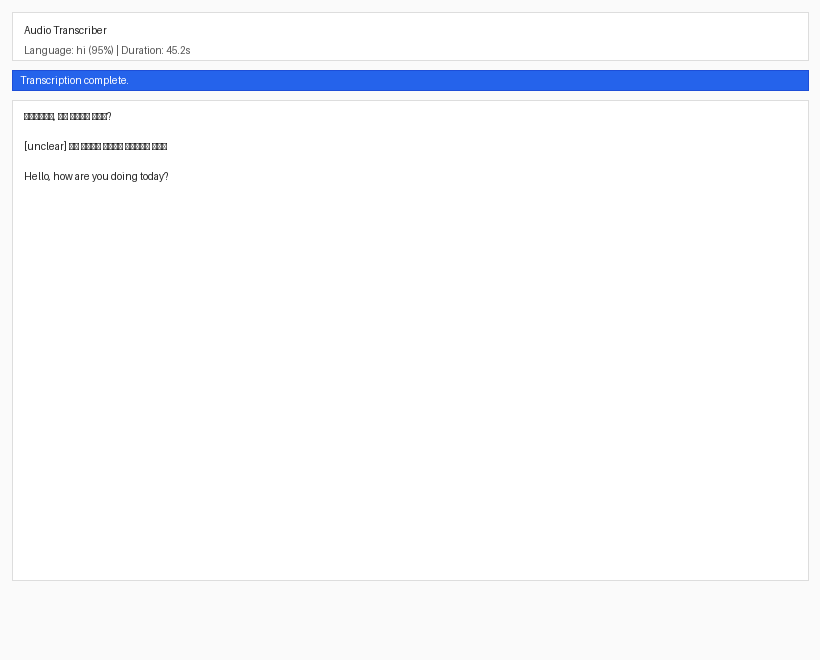

# Audio Transcriber

> A fully offline, zero-cost desktop audio transcription app powered by Faster-Whisper. No API keys. No cloud services. No subscriptions.

[](https://www.python.org/)
[](LICENSE)
[]()

---

## Screenshots

<p align="center">
  
  <br>
  <em>Main application window — select an audio file and transcribe</em>
</p>

<p align="center">
  
  <br>
  <em>Transcription result with language detection and copy/save options</em>
</p>

---

## Features

- **100% Local** — All transcription runs on your machine. No data ever leaves your computer.
- **Zero Cost** — No API keys, no subscriptions, no cloud services, no hidden fees.
- **High Accuracy** — Uses OpenAI's Whisper `large-v3` model via Faster-Whisper for state-of-the-art transcription.
- **Multi-language** — Auto-detects and transcribes Hindi, English, Hinglish, and 99+ other languages.
- **Smart Formatting** — Automatic paragraph breaks, proper punctuation, and `[unclear]` marking for low-confidence segments.
- **Multiple Formats** — Supports MP3, WAV, M4A, AAC, FLAC, OGG, WEBM, and MP4.
- **No Internet Required** — After the initial model download (~3 GB), the app works completely offline.
- **Simple Interface** — Clean, distraction-free Tkinter desktop UI.

---

## Supported Formats

| Format | Extension | Notes |
|--------|-----------|-------|
| MP3 | `.mp3` | Most common audio format |
| WAV | `.wav` | Uncompressed, highest quality |
| M4A | `.m4a` | Common on Apple devices |
| AAC | `.aac` | Advanced Audio Coding |
| FLAC | `.flac` | Lossless compression |
| OGG | `.ogg` | Free, open format |
| WEBM | `.webm` | Web-optimized audio |
| MP4 | `.mp4` | Video files (audio track extracted) |

---

## Requirements

| Requirement | Minimum | Recommended |
|------------|---------|-------------|
| **Python** | 3.10 | 3.12+ |
| **RAM** | 4 GB | 8 GB+ |
| **Disk** | 5 GB free | 10 GB+ (includes model cache) |
| **FFmpeg** | 4.0 | Latest |

### Platform Support

| Platform | Status | Notes |
|----------|--------|-------|
| **macOS** (Intel) | ✅ Fully supported | Tested on macOS 14+ |
| **macOS** (Apple Silicon M1–M4) | ✅ Fully supported | Best performance |
| **Linux** | ✅ Supported | Requires `tkinter` |
| **Windows** | ✅ Supported | Requires Python + FFmpeg |

---

## Installation

### 1. Install FFmpeg

**macOS (Homebrew):**
```bash
brew install ffmpeg
```

**Linux (apt):**
```bash
sudo apt install ffmpeg
```

**Windows (chocolatey):**
```bash
choco install ffmpeg
```

### 2. Clone & Set Up

```bash
git clone https://github.com/Prashantpd7/Audio-Transcriber.git
cd Audio-Transcriber

# Create a virtual environment (recommended)
python3 -m venv venv
source venv/bin/activate   # On Windows: venv\Scripts\activate

# Install dependencies
pip install -r requirements.txt
```

### 3. Run the App

```bash
python3 transcriber.py
```

---

## Quick Start

1. Launch the app: `python3 transcriber.py`
2. Click **Select Audio** and choose an audio file
3. Click **Transcribe**
4. Wait for transcription to complete (progress bar shows status)
5. **Copy** to clipboard or **Save** as `.txt`

**First run:** The app will download the Whisper `large-v3` model (~3 GB). This happens once. Subsequent launches are instant and fully offline.

---

## Building a Standalone macOS App

For a double-clickable `.app` bundle (macOS only):

```bash
# Install PyInstaller
pip install pyinstaller

# Build
./build.sh

# The .app is created at: dist/Audio Transcriber.app
# Copy to Applications:
cp -r "dist/Audio Transcriber.app" /Applications/
```

> **Note:** The standalone app bundle is ~800 MB. It includes all Python dependencies and can be distributed to other Macs without requiring Python.

---

## Troubleshooting

### "faster-whisper not installed"
```bash
pip install faster-whisper
```

### "No module named tkinter"
- **macOS**: `brew install python-tk`
- **Linux**: `sudo apt install python3-tk`
- **Windows**: Included with Python installer (check "tcl/tk" option)

### FFmpeg not found
Ensure FFmpeg is installed and available in your PATH:
```bash
ffmpeg -version
```

### App crashes on launch (macOS .app)
Check the log file:
```bash
cat ~/Library/Logs/AudioTranscriber.log
```

### Model download fails
The first run downloads ~3 GB. Ensure stable internet. The download resumes if interrupted.

---

## Privacy

**Your audio never leaves your computer.** All transcription happens locally using Faster-Whisper running on your machine's CPU. No data is sent to any server. No internet connection is needed after the initial model download.

- ✅ No API keys required
- ✅ No accounts or registration
- ✅ No telemetry or analytics
- ✅ No data collection
- ✅ Fully air-gapped capable

---

## Tech Stack

| Component | Technology |
|-----------|-----------|
| **Transcription Engine** | [Faster-Whisper](https://github.com/SYSTRAN/faster-whisper) (CTranslate2) |
| **Model** | Whisper `large-v3` |
| **UI Framework** | Tkinter (Python standard library) |
| **Audio Processing** | FFmpeg |
| **Language** | Python 3.10+ |

---

## Project Structure

```
Audio-Transcriber/
├── transcriber.py          # Main application
├── requirements.txt        # Python dependencies
├── build.spec              # PyInstaller build configuration
├── build.sh                # macOS .app build script
├── SETUP.md                # Detailed setup instructions
├── LICENSE                 # MIT License
├── README.md               # This file
├── .gitignore              # Git ignore rules
├── screenshots/            # Screenshot images
│   ├── app-home.png
│   └── transcription-result.png
└── docs/                   # Additional documentation
```

---

## Future Improvements

- [ ] Speaker diarization (who spoke when)
- [ ] Batch processing (multiple files)
- [ ] Dark mode theme
- [ ] Export to SRT/ass subtitle formats
- [ ] Real-time microphone transcription
- [ ] GPU acceleration for Apple Silicon (MLX)

---

## License

This project is licensed under the MIT License — see the [LICENSE](LICENSE) file for details.

---

## Contributing

Contributions are welcome! Here's how you can help:

1. Fork the repository
2. Create a feature branch: `git checkout -b feature/my-feature`
3. Commit your changes: `git commit -am 'Add my feature'`
4. Push: `git push origin feature/my-feature`
5. Open a Pull Request

Please ensure your code follows the existing style and includes appropriate error handling.

---

## Credits

- [OpenAI Whisper](https://github.com/openai/whisper) — The original speech recognition model
- [Faster-Whisper](https://github.com/SYSTRAN/faster-whisper) — CTranslate2-optimized inference engine
- [FFmpeg](https://ffmpeg.org/) — Audio processing
- Built with ❤️ by [Prashant Dwivedi](https://github.com/Prashantpd7)
